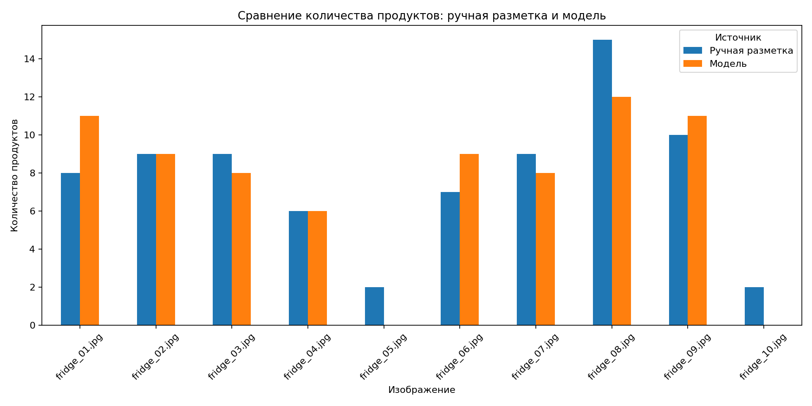
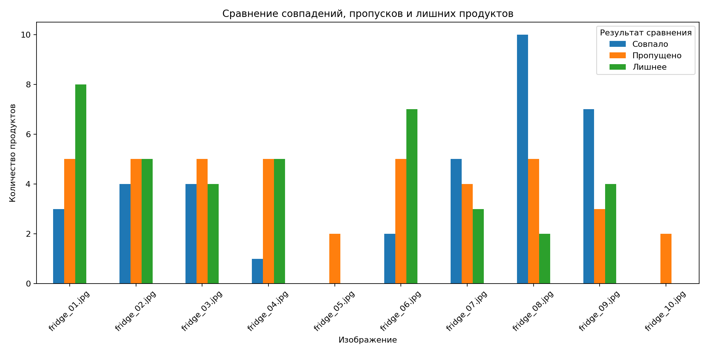
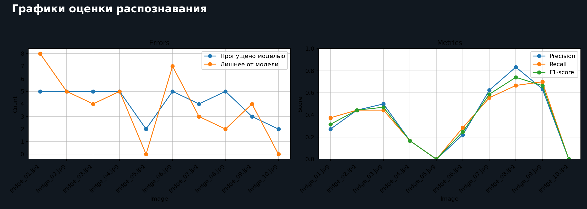
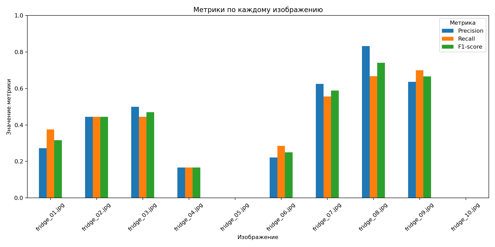
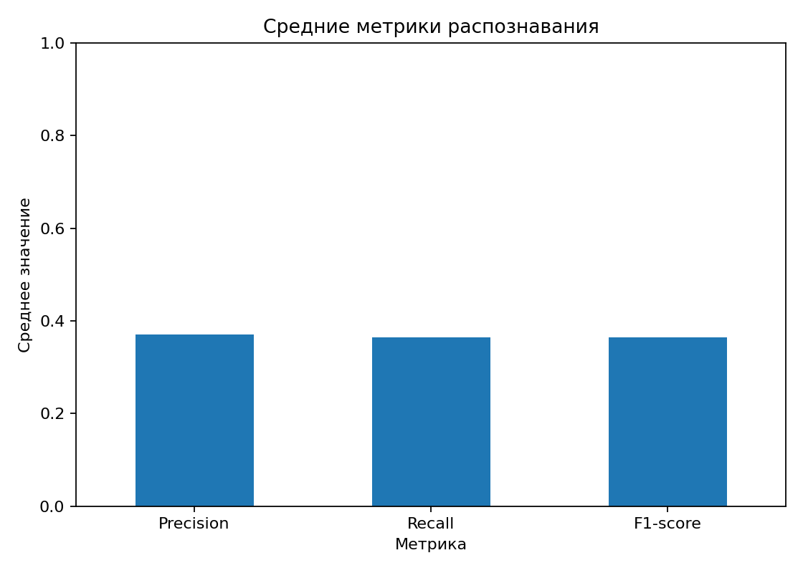

# Краткий отчёт по лабораторной работе 3

## Тема
Рецепт по фото холодильника с использованием мультимодальной модели.

## Цель
Разработать приложение, которое по фотографии содержимого холодильника или продуктовой полки распознаёт продукты и предлагает 2–3 рецепта на их основе.

## Реализация
В проекте реализован следующий пайплайн:

1. Пользователь загружает фотографию холодильника, продуктовой полки или отдельных продуктов.
2. Мультимодальная модель через Groq API распознаёт продукты на изображении.
3. На основе найденного списка продуктов языковая модель генерирует 2–3 рецепта.
4. Пользователь может применить фильтры: вегетарианское питание, максимальное время готовки, сложность и количество порций.
5. Для оценки качества используется набор из 10 фотографий и файл ручной разметки `eval_expected.csv`.

## Используемые технологии
- Python;
- Streamlit для веб-интерфейса;
- pandas для отображения таблиц и Eval;
- python-dotenv для переменных окружения;
- Groq API для распознавания продуктов и генерации рецептов.

## Eval
Для этапа оценки был подготовлен набор из 10 изображений. Для каждого изображения вручную указан список продуктов. Скрипт `evaluate.py` сравнивает результат модели с эталоном и рассчитывает:

- найденные продукты;
- пропущенные продукты;
- ошибочно добавленные продукты;
- precision;
- recall;
- F1-score.

После запуска `evaluate.py` результаты сохраняются в виде CSV-таблицы. В конце скрипт дополнительно выводит сравнение ручной разметки и ответа модели, таблицу средних значений precision, recall и F1-score, а также сохраняет графики.

Сравнение ручной разметки и ответа модели для текущего запуска Eval:

| Фото | Вручную | Модель | Совпало | Пропущено | Лишнее |
| --- | ---: | ---: | ---: | ---: | ---: |
| fridge_01.jpg | 8 | 11 | 3 | 5 | 8 |
| fridge_02.jpg | 9 | 9 | 4 | 5 | 5 |
| fridge_03.jpg | 9 | 8 | 4 | 5 | 4 |
| fridge_04.jpg | 6 | 6 | 1 | 5 | 5 |
| fridge_05.jpg | 2 | 0 | 0 | 2 | 0 |
| fridge_06.jpg | 7 | 9 | 2 | 5 | 7 |
| fridge_07.jpg | 9 | 8 | 5 | 4 | 3 |
| fridge_08.jpg | 15 | 12 | 10 | 5 | 2 |
| fridge_09.jpg | 10 | 11 | 7 | 3 | 4 |
| fridge_10.jpg | 2 | 0 | 0 | 2 | 0 |

График сравнения ручной разметки и модели:

График совпадений и ошибок:

Общий график оценки в формате двух графиков рядом:

Итоговые значения для текущего запуска Eval:

| Метрика | Среднее значение |
| --- | ---: |
| Precision | 0.370 |
| Recall | 0.364 |
| F1-score | 0.364 |

График метрик по каждому изображению:

График средних значений:

## Вывод
Полученный проект соответствует заданию лабораторной работы. Система принимает изображение, распознаёт продукты с помощью VLM и формирует рецепты с помощью LLM. Дополнительно реализован этап оценки качества на наборе фотографий.
